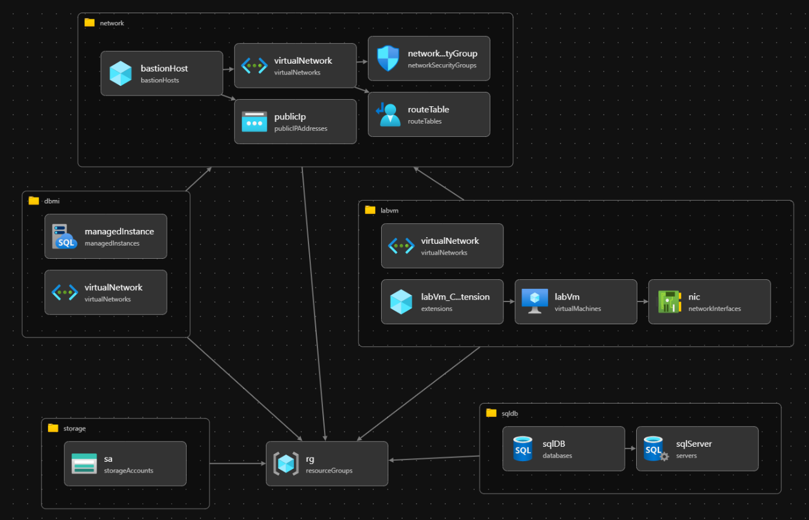

# Initial Lab Environment Setup
1. Deploy training resources in Azure Subscription:
    - Open Cloud Shell
    - Git clone Bicep files: `git clone https://github.com/cbattlegear/SqlServerMigrationTraining.git`
    - Go into directory: `cd SQLMigrationTraining/`
    - Execute main.bicep: `az deployment sub create --location eastus2 --template-file main.bicep`
    - Walk through on-screen instructions. ***Note:*** For resource names, use all lowercase and avoid underscored and dashes. For password, 16 chars, upper, lower, number.

      ***Deployment will take ~3 hours due to Azure SQL MI provisioning.***
 2. Verify environment deployment.
    
    - Deployed resource group should contain the following: 
        - Azure Bastion 
        - Azure Disk (attached to VM)
        - Azure Network Interface
        - Azure Network Security Group (1 of them)
        - Azure Public IP Address (For Bastion)
        - Azure Route Table (For SQL MI)
        - Azure Storage Account
        - Azure SQL Database (attached to Azure SQL Server)
        - Azure SQL Managed Instance
        - Azure SQL Server (Has 1 DB attached)
        - Azure SQL Virtual Machine (same as Azure VM name)
        - Azure Virtual Cluster (For SQL MI)
        - Azure Virtual Machine (same as Azure SQL VM)
        - Azure VNET

    - Bastion into VM in the deployed resource group.
      - Verify the following is installed: 
          - SQL Server 2012 - AdventureWorks2012
          - SQL Server 2016 - AdventureWorks2016
          - SQL Server 2019 - AdventureWorks2019
          - SQL Server Management Studio
          - Azure Data Studio 
          - Data Migration Assistant - ***Note:*** Download and install. 
          
 3. Supporting documents: 
    - [TSQL - SQL backup and restore to Azure Blob Storage](https://learn.microsoft.com/en-us/sql/relational-databases/tutorial-sql-server-backup-and-restore-to-azure-blob-storage-service?view=sql-server-ver16&tabs=SSMS)
    - [TSQL - Create SQL Server credentials for authentication to Azure Blob Storage](https://learn.microsoft.com/en-us/sql/relational-databases/backup-restore/sql-server-backup-to-url?view=sql-server-ver16#credential)
    - [Migrate SQL Server to Azure SQL MI online using Azure Data Studio with DMS](https://learn.microsoft.com/en-us/azure/dms/tutorial-sql-server-managed-instance-online-ads)
    - [Migrate SQL Server to Azure SQL DB using Data Migration Assistant (DMA)](https://learn.microsoft.com/en-us/sql/dma/dma-migrateonpremsqltosqldb?view=sql-server-ver16)